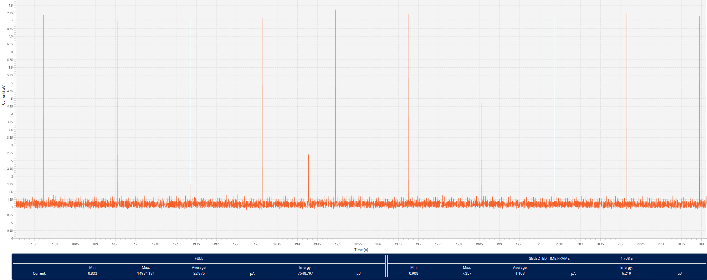

# STM32WB15 Low-Power Health Temperature Sensor

## Project Overview
This project implements a low-power temperature measurement solution with connectivity to a peer-to-peer client via Bluetooth Low Energy (BLE).

## Target Device
- **STM32WB15CG**

---

## Getting Started

1. Download the project into the `STM32Cube_FW_WB_V1.22.1\Projects\NUCLEO-WB15CC\Applications\BLE` directory.
2. Upload the `BLE_Stack_full` binary to the coprocessor on your STM32WB15 board.

---

## About the Project

This project is a modification of the ST example `BLE_HealthThermometer`, originally designed for the `STM32WB55`. It replicates the same functionality on the `STM32WB15` while introducing optimizations to minimize power consumption. Key enhancements include:

- **Low-Power Advertising:** Advertising interval increased from ~100 ms to ~1.5 s to reduce power usage.
- **Standby Mode Support:** The device enters standby mode between measurements, achieving an idle current consumption of approximately 1.1 μA.
- **Connection Interval Adjustment:** Upon connection, a request is made to change the connection interval to about 1 s to optimize power and performance.
- **Power-Consuming Features Disabled:** Unnecessary timers, LED blinking, button functions, and other peripherals are disabled to save power.

---

## ADC Functionality

The ADC calibration and startup are consolidated within the `HTSAPP_Measurement_start` function, which is triggered by a timer. This approach ensures the ADC is enabled only when needed, optimizing power consumption by avoiding repeated calibration after waking from standby.

- Currently, calibration occurs at each measurement start.
- Potential improvement: Save and restore the calibration factor in software to reduce initialization time, assuming stable temperature and voltage during ADC power-down.

Measurements are triggered every 1 second by a timer initialized in the `HTSAPP_Init` function (`hts_app.c`).

---

## ST BLE Toolbox Usage

To view the measured data using the **ST BLE Toolbox** application:

1. Flash the program onto your Nucleo board.
2. Launch the ST BLE Toolbox app and start scanning.
3. Locate and connect to the device named `HTSTM`.
4. After connection, select the **Health Thermometer** profile to display temperature data.

---

## Power Consumption Overview

### Advertising Mode

### Standby Mode

### Connection Interval Change

### Measurement and BLE Data Transmission

## Troubleshooting

**Caution** : Issues and the pull-requests are **not supported** to submit problems or suggestions related to the software delivered in this repository. The STM32WB15 Low-Power Health Temperature Sensor example is being delivered as-is, and not necessarily supported by ST.

**For any other question** related to the product, the hardware performance or characteristics, the tools, the environment, you can submit it to the **ST Community** on the STM32 MCUs related [page](https://community.st.com/s/topic/0TO0X000000BSqSWAW/stm32-mcus).